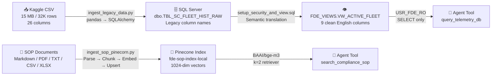
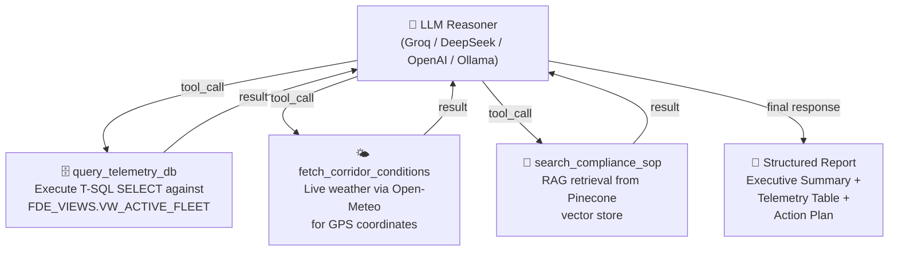
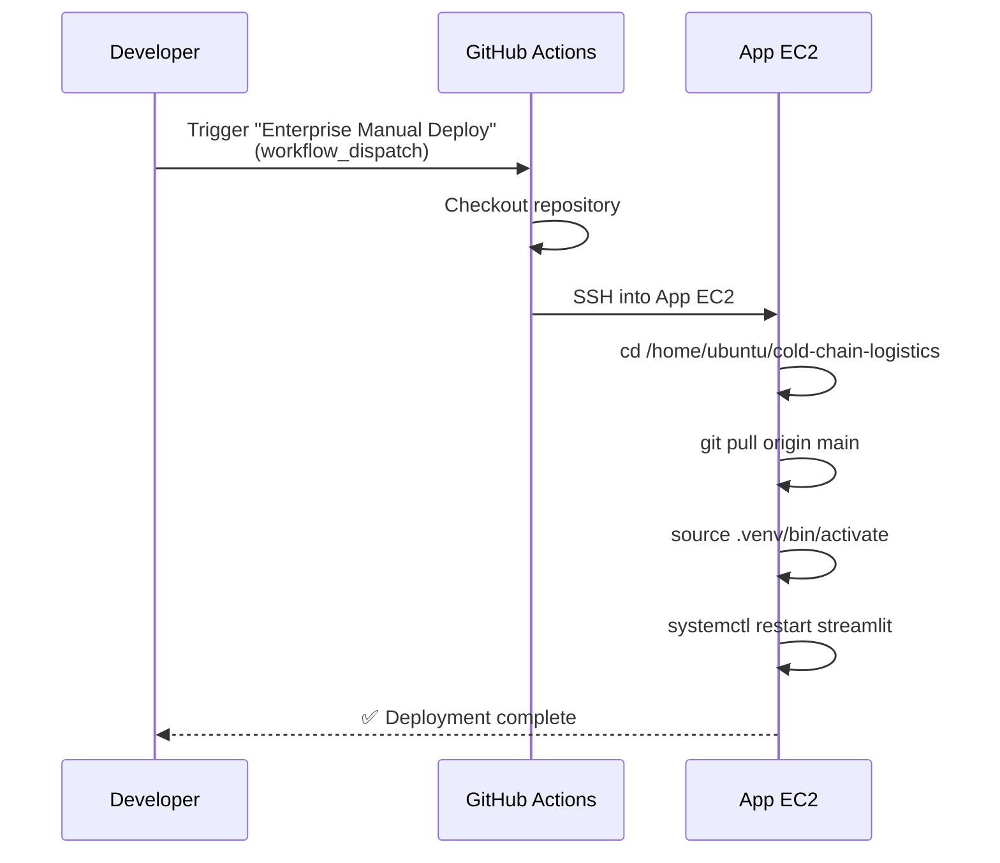

# 🧊 Cold-Chain Logistics — AI Dispatch Console

> An AI-powered enterprise platform that enables business stakeholders to **chat with their operational data** in real time — investigating cold-chain anomalies, route disruptions, and compliance violations through a conversational dispatch agent.


---

## 📋 Table of Contents

- [Overview](#overview)
- [Key Features](#key-features)
- [System Architecture](#system-architecture)
- [AWS Infrastructure](#aws-infrastructure)
- [Data Pipeline](#data-pipeline)
- [Agent Tool System](#agent-tool-system)
- [Database Security Model](#database-security-model)
- [Technology Stack](#technology-stack)
- [CI/CD Pipeline](#cicd-pipeline)
- [Project Structure](#project-structure)
- [Getting Started](#getting-started)
- [Environment Variables](#environment-variables)
- [Usage](#usage)

---

## Overview

Traditional logistics dashboards force analysts to write SQL, switch between tools, and manually cross-reference weather data with fleet telemetry. **This platform eliminates that friction.**

A business user types a natural-language question like:

> *"Are there any cold-chain breaches near the Port of Long Beach right now?"*

The AI agent autonomously:

1. **Queries the fleet telemetry database** — pulling live temperature readings, risk classifications, and delay probabilities from SQL Server.
2. **Checks real-time corridor conditions** — hitting a live weather API to assess wind speed, temperature, and transit disruption risk at the shipment's GPS coordinates.
3. **Retrieves compliance SOPs** — searching the Pinecone vector database for the relevant Standard Operating Procedures that dictate the correct mitigation protocol.
4. **Synthesizes a structured report** — delivering an Executive Summary, Telemetry Analysis table, and a cited Action Plan back to the user in seconds.

Every tool invocation, LLM reasoning step, and final response is logged to a dedicated SQL audit table — providing a full, queryable trail of every decision the agent made.

---

## Key Features

| Feature | Description |
|---|---|
| 🤖 **Conversational Agent** | LangGraph-powered reasoning loop with autonomous tool selection |
| 🗄️ **Fleet Telemetry Queries** | Natural language → SQL against 32,000+ fleet records |
| 🌤️ **Live Corridor Intelligence** | Real-time weather and congestion data from Open-Meteo API |
| 📜 **Compliance SOP Retrieval** | RAG-powered search across enterprise Standard Operating Procedures via Pinecone |
| 🛡️ **Enterprise Audit Trail** | Every agent action logged to SQL with session tracking |
| 🔐 **Database Security Layer** | Read-only agent user, semantic views, explicit DENY rules |
| ⚡ **Multi-LLM Support** | Swap between Groq, DeepSeek, OpenAI, or local Ollama via a single env variable |
| 🎨 **Dark-Themed Enterprise UI** | Streamlit-based console with expandable tool traces and admin-authenticated audit viewer |

---

## System Architecture

The platform runs across **two dedicated AWS EC2 instances** that communicate over a private network:

```
┌──────────────────────────────────────────────────────────────────────────┐
│                         AWS Cloud Infrastructure                        │
│                                                                         │
│  ┌─────────────────────────────┐    ┌────────────────────────────────┐  │
│  │   EC2 Instance #1 (App)     │    │   EC2 Instance #2 (Database)   │  │
│  │                             │    │                                │  │
│  │  ┌───────────────────────┐  │    │  ┌──────────────────────────┐  │  │
│  │  │   Streamlit Web App   │  │    │  │  Docker Container        │  │  │
│  │  │   (Port 8501)         │  │    │  │  ┌──────────────────┐   │  │  │
│  │  └──────────┬────────────┘  │    │  │  │  SQL Server 2022 │   │  │  │
│  │             │               │    │  │  │  (Port 1433)     │   │  │  │
│  │  ┌──────────▼────────────┐  │    │  │  └──────────────────┘   │  │  │
│  │  │  LangGraph Agent      │  │    │  │                          │  │  │
│  │  │  (Orchestrator)       │──┼────┼──▶  FDE_VIEWS Schema        │  │  │
│  │  └──────────┬────────────┘  │    │  │  ├─ VW_ACTIVE_FLEET     │  │  │
│  │             │               │    │  │  └─ AgentAuditLog       │  │  │
│  │  ┌──────────▼────────────┐  │    │  └──────────────────────────┘  │  │
│  │  │  Agent Tools          │  │    │                                │  │
│  │  │  ├─ SQL Telemetry ────┼──┼────┘                                │  │
│  │  │  ├─ Weather API ──────┼──┼────── → Open-Meteo REST API        │  │
│  │  │  └─ SOP Retrieval ────┼──┼────── → Pinecone Cloud (us-east-1) │  │
│  │  └───────────────────────┘  │                                     │  │
│  └─────────────────────────────┘    └────────────────────────────────┘  │
│                                                                         │
│        Security Groups:                                                 │
│        • App EC2 ← Inbound 8501 (Streamlit)                           │
│        • DB EC2  ← Inbound 1433 (SQL Server, restricted to App SG)    │
└──────────────────────────────────────────────────────────────────────────┘
```

### How the Instances Communicate

| Flow | Protocol | Direction |
|---|---|---|
| **App → DB** (telemetry queries) | ODBC over TCP/1433 | App EC2 → DB EC2 |
| **App → DB** (audit logging) | ODBC over TCP/1433 | App EC2 → DB EC2 |
| **App → Pinecone** (SOP retrieval) | HTTPS | App EC2 → Pinecone Cloud |
| **App → Open-Meteo** (weather) | HTTPS | App EC2 → Public API |
| **App → LLM Provider** (reasoning) | HTTPS | App EC2 → Groq / DeepSeek / OpenAI Cloud |
| **User → App** (web UI) | HTTPS/8501 | Browser → App EC2 |

> **Key design decision:** The database EC2 security group only allows inbound traffic on port 1433 from the Application EC2's security group — it is **not** exposed to the public internet.

---

## Data Pipeline

The system ingests data from two distinct sources into two separate storage backends:



### Pipeline 1: Fleet Telemetry (Structured Data)

| Step | Description |
|---|---|
| **Source** | [Kaggle Logistics & Supply Chain Dataset](https://www.kaggle.com/datasets/datasetengineer/logistics-and-supply-chain-dataset) — 32,065 rows, 26 columns |
| **Transform** | 9 relevant columns are selected and renamed to simulate a legacy enterprise schema (e.g., `vehicle_gps_latitude` → `V_LAT`) |
| **Load** | Data is written to `dbo.TBL_SC_FLEET_HIST_RAW` on the DB EC2 via SQLAlchemy |
| **Semantic Layer** | A SQL view (`FDE_VIEWS.VW_ACTIVE_FLEET`) translates legacy column names back to clean English for the AI agent |

### Pipeline 2: Compliance SOPs (Unstructured Data)

| Step | Description |
|---|---|
| **Source** | Markdown/PDF/TXT/CSV/XLSX files in `data/policy/` |
| **Parse** | Polymorphic parser handles each format — Markdown header-aware splitting, PDF page extraction, CSV row-to-text conversion |
| **Chunk** | `RecursiveCharacterTextSplitter` (600 chars, 60 overlap) |
| **Embed** | `BAAI/bge-m3` locally or OpenAI (configurable) |
| **Upsert** | Batched upsert to Pinecone with explicit document IDs and metadata |
| **Caching** | MD5 hash cache prevents re-processing unchanged files |

---

## Agent Tool System

The LangGraph agent has access to three specialized tools:



| Tool | Input | Output | Backend |
|---|---|---|---|
| `query_telemetry_db` | T-SQL SELECT query | Formatted rows (max 10) | SQL Server via ODBC |
| `fetch_corridor_conditions` | Latitude, Longitude | Temperature, wind speed, congestion index | Open-Meteo REST API |
| `search_compliance_sop` | Natural language query | Top-2 matching SOP chunks with source metadata | Pinecone + bge-m3 |

---

## Database Security Model

The system implements a **defense-in-depth** approach to protect legacy data from uncontrolled AI access:

```
┌─────────────────────────────────────────────────────────┐
│                     SQL Server                          │
│                                                         │
│  ┌───────────────────────────────────────────────────┐  │
│  │  dbo.TBL_SC_FLEET_HIST_RAW  (raw legacy table)   │  │
│  │  ❌ DENY SELECT to USR_FDE_RO                     │  │
│  │  ❌ DENY INSERT, UPDATE, DELETE, ALTER on dbo     │  │
│  └───────────────────────────────────────────────────┘  │
│                          │                              │
│                    SQL View                              │
│                          ▼                              │
│  ┌───────────────────────────────────────────────────┐  │
│  │  FDE_VIEWS.VW_ACTIVE_FLEET  (semantic view)       │  │
│  │  ✅ GRANT SELECT to USR_FDE_RO                    │  │
│  │  Translates: V_LAT → Latitude, etc.              │  │
│  └───────────────────────────────────────────────────┘  │
│                                                         │
│  ┌───────────────────────────────────────────────────┐  │
│  │  FDE_VIEWS.AgentAuditLog  (audit table)           │  │
│  │  ✅ GRANT INSERT to USR_FDE_RO                    │  │
│  └───────────────────────────────────────────────────┘  │
│                                                         │
│  Users:                                                 │
│  • sa (admin) — full access, used only for ingestion   │
│  • USR_FDE_RO (agent) — read view + write audit only   │
└─────────────────────────────────────────────────────────┘
```

---

## Technology Stack

| Layer | Technology | Purpose |
|---|---|---|
| **Frontend** | Streamlit | Dark-themed enterprise dispatch console |
| **Agent Framework** | LangGraph + LangChain | Stateful multi-step reasoning with tool calls |
| **LLM (Configurable)** | Groq / DeepSeek / OpenAI / Ollama | Agent reasoning engine |
| **Embeddings** | BAAI/bge-m3 (HuggingFace) or OpenAI | Document vectorization for RAG |
| **Vector Store** | Pinecone (Serverless) | SOP compliance document retrieval |
| **Database** | Microsoft SQL Server 2022 (Docker) | Fleet telemetry storage + audit logs |
| **Weather API** | Open-Meteo | Real-time corridor and weather conditions |
| **Infrastructure** | AWS EC2 (×2) | Application server + Database server |
| **CI/CD** | GitHub Actions + SSH | Automated deployment on manual trigger |
| **Language** | Python 3.11+ | Core application language |

---

## CI/CD Pipeline

The project uses a **GitHub Actions** workflow for manual deployment to the Application EC2 instance:



| Setting | Value |
|---|---|
| **Trigger** | Manual (`workflow_dispatch`) |
| **Target** | Configurable environment (default: `FDE-YT-Cold`) |
| **Deploy Method** | SSH via `appleboy/ssh-action@v1.0.3` |
| **Secrets Required** | `EC2_HOST`, `EC2_USER`, `EC2_SSH_KEY` (stored in GitHub Secrets) |
| **Post-Deploy** | Streamlit systemd service is restarted |

---

## Project Structure

```
cold-chain-logistics/
│
├── src/
│   ├── UI/
│   │   └── UI.py                  # Streamlit frontend — chat UI + audit viewer
│   ├── orchestrator/
│   │   └── orchestrator.py        # LangGraph agent — reasoner + tools loop
│   ├── tools/
│   │   └── agent_tools.py         # 3 tools: SQL, Weather API, Pinecone SOP
│   └── prompts/
│       └── system_prompts.txt     # Agent persona & output format instructions
│
├── scripts/
│   ├── ingest_legacy_data.py      # CSV → SQL Server ingestion
│   ├── ingest_sop_pinecorn.py     # SOP docs → Pinecone vectorization
│   ├── setup_security_and_view.sql        # Schema, view, and agent user creation
│   └── create_tabel_fde_view_agentAuditLog.sql  # Audit log table setup
│
├── data/
│   ├── raw/                       # Kaggle CSV dataset (32K rows, ~15 MB)
│   ├── policy/                    # SOP compliance documents
│   ├── source/                    # Dataset source reference
│   └── cache/                     # MD5 hash cache for incremental ingestion
│
├── docs/
│   ├── ec2_setup_guide.md         # Step-by-step EC2 + Docker + SQL Server setup
│   └── instructions.md            # Quick-start ingestion instructions
│
├── .github/workflows/
│   └── deploy.yml                 # GitHub Actions manual deploy workflow
│
├── .env                           # Environment variables (not committed)
├── .gitignore
└── requirements.txt               # Python dependencies
```

---

## Getting Started

### Prerequisites

- Python 3.11+
- ODBC Driver 18 for SQL Server
- Access to the Database EC2 instance (SQL Server running in Docker)
- Pinecone API key
- At least one LLM provider API key (Groq, DeepSeek, or OpenAI)

### 1. Clone and Install

```bash
git clone https://github.com/<your-org>/cold-chain-logistics.git
cd cold-chain-logistics

python -m venv .venv
# Windows
.venv\Scripts\activate
# Linux/Mac
source .venv/bin/activate

pip install -r requirements.txt
```

### 2. Configure Environment

Create a `.env` file in the project root:

```env
# Core API Keys
PINECONE_API_KEY=your_pinecone_key
GROQ_API_KEY=your_groq_key

# Embeddings
Embeddings_model=Local
Local_Embedding_Model=BAAI/bge-m3

# LLM
AGENT_LLM_SETTING=GROQ
GROQ_MODEL=openai/gpt-oss-120b

# Database — Admin (for ingestion only)
SQL_ADMIN_USER=sa
SQL_ADMIN_PASSWORD=your_admin_password

# Database — Agent (for runtime, read-only)
SQL_AGENT_USER=USR_FDE_RO
SQL_AGENT_PASSWORD=your_agent_password

# Database Connection
SQL_SERVER_HOST=<DB_EC2_PRIVATE_IP>
SQL_SERVER_PORT=1433
```

### 3. Ingest Data

```bash
# Step 1: Load the CSV into SQL Server
python scripts/ingest_legacy_data.py

# Step 2: Run the SQL security scripts on the DB server
# (See docs/ec2_setup_guide.md for detailed instructions)

# Step 3: Vectorize SOP documents into Pinecone
python scripts/ingest_sop_pinecorn.py
```

### 4. Launch the Application

```bash
streamlit run src/UI/UI.py
```

The console will open at `http://localhost:8501`.

---

## Environment Variables

| Variable | Required | Description |
|---|---|---|
| `PINECONE_API_KEY` | ✅ | Pinecone vector database API key |
| `AGENT_LLM_SETTING` | ✅ | LLM provider: `GROQ`, `DEEPSEEK`, `OPENAI`, or `OLLAMA` |
| `GROQ_API_KEY` | If GROQ | Groq cloud API key |
| `GROQ_MODEL` | If GROQ | Model identifier (default: `openai/gpt-oss-120b`) |
| `DEEPSEEK_API_KEY` | If DEEPSEEK | DeepSeek API key |
| `Embeddings_model` | ❌ | `Local` (default) or `OPENAI` |
| `Local_Embedding_Model` | ❌ | HuggingFace model ID (default: `BAAI/bge-m3`) |
| `SQL_ADMIN_USER` | ✅ | SQL Server admin username (for data ingestion) |
| `SQL_ADMIN_PASSWORD` | ✅ | SQL Server admin password |
| `SQL_AGENT_USER` | ✅ | Read-only agent SQL username |
| `SQL_AGENT_PASSWORD` | ✅ | Agent SQL password |
| `SQL_SERVER_HOST` | ✅ | Database EC2 IP address |
| `SQL_SERVER_PORT` | ❌ | SQL Server port (default: `1433`) |

---

## Usage

### Dispatch Console

Type natural-language queries to investigate fleet operations:

- *"Show me all shipments with a temperature above 4°C"*
- *"What are the current weather conditions at latitude 33.77, longitude -118.19?"*
- *"What is the SOP for handling cold-chain breaches on fresh perishables?"*
- *"Are there any high-risk shipments near Long Beach with a delay probability above 0.65?"*

The agent will autonomously decide which tools to invoke, execute them, and return a structured operational report.

### Audit Log Viewer

Switch to **"Security & Audit Logs"** mode in the sidebar. Authenticate with admin credentials to view a complete, timestamped log of every tool call and LLM response across all sessions.

---

## License

This project is proprietary and intended for internal enterprise use.
